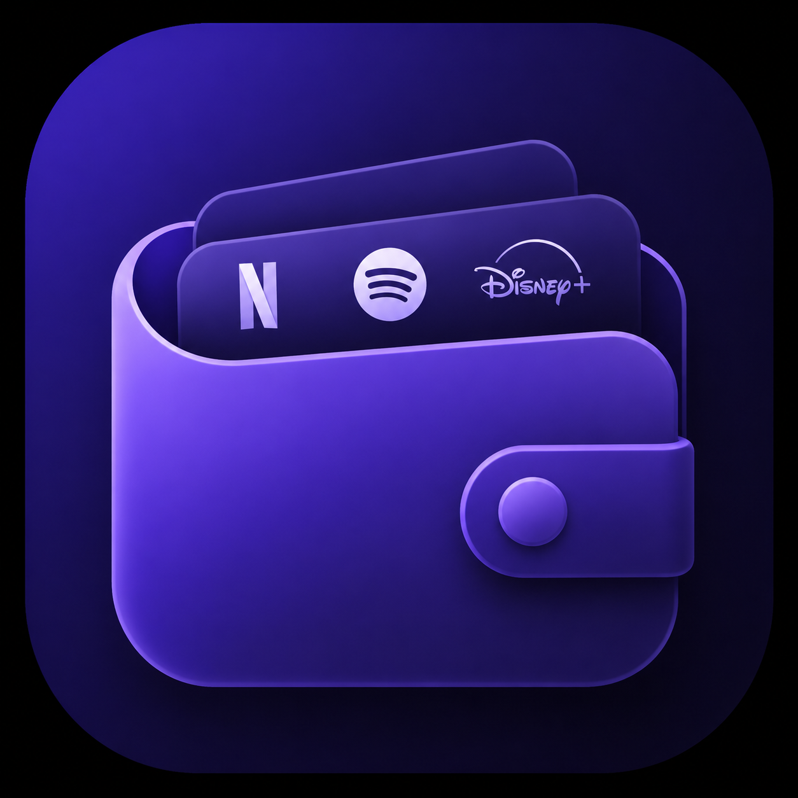

<div align="center">



# Wallet

**Suivez vos abonnements. Visualisez vos dépenses. Reprenez le contrôle.**

[](https://expo.dev)
[](https://reactnative.dev)
[](https://android.com)
[](LICENSE)

</div>

---

## Aperçu

Wallet est une application mobile minimaliste pour tracker tous vos abonnements mensuels et annuels — Netflix, Spotify, salle de sport, VPN — au même endroit. Interface sombre, données locales, aucune inscription.

## Fonctionnalités

- **Vue mensuelle / annuelle** — bascule en un tap pour voir ce que vous dépensez réellement par an
- **Camembert interactif** — visualisez quels abonnements pèsent le plus, avec les vraies couleurs de chaque marque
- **Logos automatiques** — recherche de marques via Clearbit, logos via Google Favicon
- **Couleurs de marque** — extraction automatique via l'API Brandfetch
- **Suppression par swipe** — glissez vers la gauche pour supprimer, avec confirmation
- **Données 100% locales** — SQLite embarqué, aucune donnée envoyée sur un serveur
- **Notifications de renouvellement** — voyez en un coup d'œil quels abonnements arrivent à échéance

## Stack technique

| Couche | Technologie |
|--------|-------------|
| Framework | Expo SDK 54 / React Native 0.81 |
| Navigation | React Navigation v7 |
| Base de données | expo-sqlite |
| Graphiques | react-native-svg |
| Stockage sécurisé | expo-secure-store |
| Icônes | @expo/vector-icons (Ionicons) |
| Gradients | expo-linear-gradient |
| Haptics | expo-haptics |
| Build | EAS Build |

## Installation

```bash
# Cloner le repo
git clone https://github.com/ton-user/wallet.git
cd wallet

# Installer les dépendances
npm install

# Lancer en développement
npx expo start
```

Scanner le QR code avec **Expo Go** (Android / iOS).

## Configuration Brandfetch *(optionnel)*

Pour afficher les vraies couleurs des marques dans le camembert :

1. Créer un compte gratuit sur [brandfetch.com](https://brandfetch.com) — 500 req/mois inclus
2. Copier votre clé API
3. Au premier lancement de l'app, coller la clé dans le modal de configuration

> La clé est stockée localement sur l'appareil via `expo-secure-store`. Elle n'est jamais incluse dans le build.

## Build Android (APK)

```bash
# Installer EAS CLI
npm install -g eas-cli

# Se connecter à Expo
eas login

# Builder l'APK
eas build --platform android --profile preview
```

Le lien de téléchargement APK est disponible sur [expo.dev](https://expo.dev) à la fin du build.

## Structure du projet

```
src/
├── components/
│   ├── ApiKeyModal.tsx       # Modal de configuration Brandfetch
│   ├── BrandIcon.tsx         # Logo de marque avec fallback
│   ├── IconPicker.tsx        # Recherche de marques (Clearbit)
│   ├── StatsCard.tsx         # Carte résumé + camembert
│   └── SubscriptionCard.tsx  # Carte abonnement avec swipe-to-delete
├── config/
│   └── api.ts                # Tokens API (Brandfetch vide par défaut)
├── constants/
│   └── theme.ts              # Design system (couleurs, typo, spacing)
├── database/
│   └── db.ts                 # Opérations SQLite
├── screens/
│   ├── HomeScreen.tsx
│   └── AddSubscriptionScreen.tsx
├── types/
│   └── index.ts
└── utils/
    ├── color.ts              # Extraction couleur via Brandfetch
    ├── renewal.ts            # Calcul dates de renouvellement
    └── settings.ts           # Gestion clé API (SecureStore)
```

## Licence

MIT — libre d'utilisation, modification et distribution.

---

<div align="center">
  Fait avec ☕ par <a href="https://github.com/TomCard">Tomu</a>
</div>
